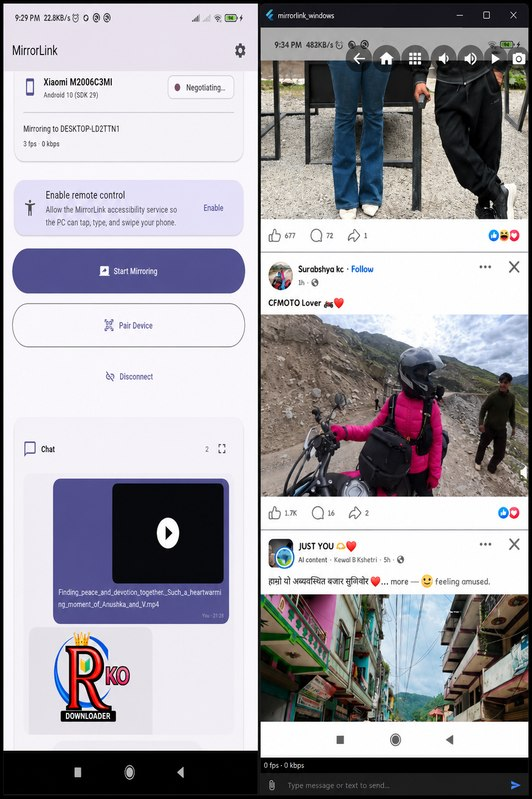

# MirrorLink 🖥️📱

**Mirror your Android screen to your Windows PC — control it with mouse & keyboard, transfer any file, and sync the clipboard. Wireless and free. No accounts, no cloud servers.**

## ⬇️ Downloads (latest release below)

Which file do you need?

| Device | File | Notes |
|--------|------|-------|
| 🤖 **Android phone** | `app-release.apk` | Install on your phone. Works on Android 10+ |
| 🖥️ **Windows PC** | `MirrorLink-Setup-<version>.exe` | Installer — creates Start Menu + Desktop shortcut |

> **Note:** The Windows installer is unsigned, so Windows SmartScreen may show a warning. Click **More info → Run anyway**.

## ✨ Features

- 🔄 **Wireless mirroring** — WebRTC screen sharing, low latency, works on your Wi-Fi only
- 🖱️ **Full remote control** — tap, swipe, type messages, open apps & settings with mouse & keyboard from your PC
- 📂 **Send any file type** — APK, PDF, ZIP, Excel, HTML, JS, photos & videos, both directions
- 📋 **Clipboard sync** — copy on one device, paste on the other
- 👆 **Tap to open on phone** — received files open/install from the chat
- 🔒 **Private & secure** — no accounts, no cloud servers, no data collection
- 💻 **One companion app** on each side of the connection

## 📦 Releases

Every time a new version is released on the main repo, the Android APK and Windows installer are published here automatically.
